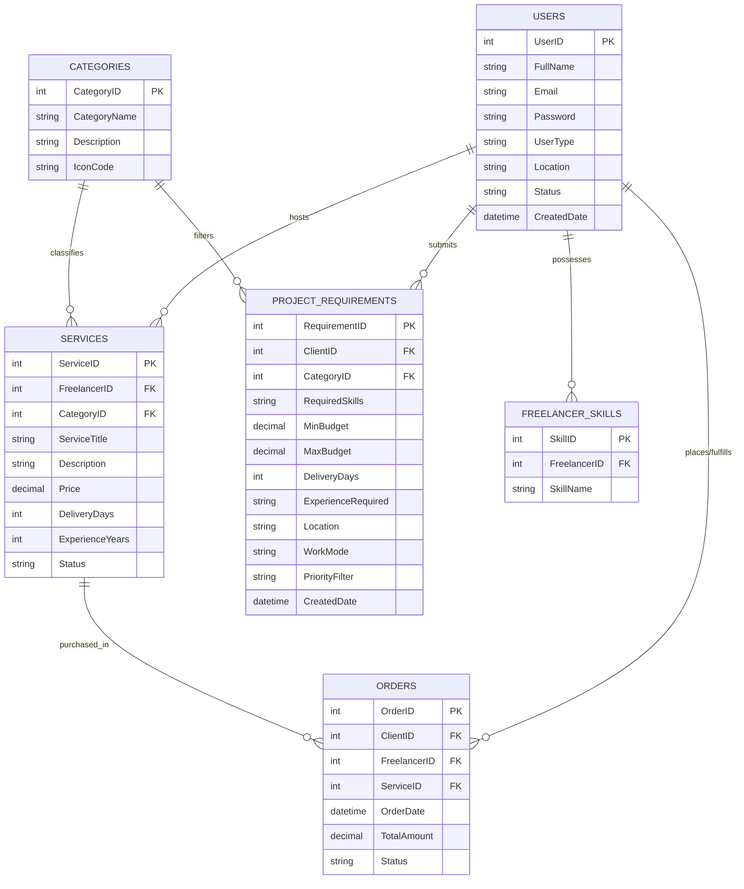
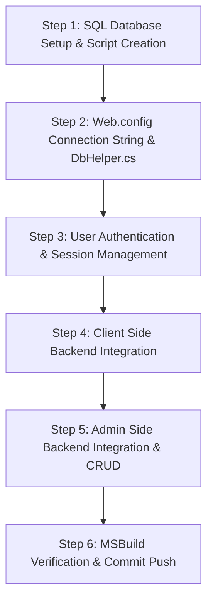

# SkillSync — Backend & Database Implementation Plan

This document outlines the complete **Database Schema Architecture**, **Page-by-Page Backend Blueprint**, **ADO.NET Integration Plan**, and **SQL Tables Mapping** for both **Client Side** and **Admin Side** modules of the **SkillSync** platform.

---

## 1. Database Schema Architecture (SQL Server)

To support all marketplace operations (User Authentication, Service Listings, Requirement Input, Smart Matching Engine, Candidate Comparison, Admin Metrics, and Order Management), the database consists of **6 Relational SQL Tables**:



---

### Detailed Table Schemas

#### Table 1: `Users`
Stores account profiles for Clients, Freelancers, and Administrators.
| Column Name | Data Type | Constraints | Description |
| :--- | :--- | :--- | :--- |
| `UserID` | `INT` | `PRIMARY KEY IDENTITY(1,1)` | Unique user identification ID |
| `FullName` | `NVARCHAR(100)` | `NOT NULL` | User full name |
| `Email` | `NVARCHAR(150)` | `NOT NULL UNIQUE` | User email (Login ID) |
| `Password` | `NVARCHAR(255)` | `NOT NULL` | Password |
| `UserType` | `NVARCHAR(20)` | `NOT NULL` | Account role: `'Client'`, `'Freelancer'`, `'Admin'` |
| `Location` | `NVARCHAR(100)` | `NULL` | City/Region (e.g. `'Mumbai'`, `'Pune'`) |
| `Status` | `NVARCHAR(20)` | `NOT NULL DEFAULT 'Active'` | Account status: `'Active'`, `'Inactive'` |
| `CreatedDate` | `DATETIME` | `NOT NULL DEFAULT GETDATE()` | Registration timestamp |

#### Table 2: `Categories`
Stores service domain categories.
| Column Name | Data Type | Constraints | Description |
| :--- | :--- | :--- | :--- |
| `CategoryID` | `INT` | `PRIMARY KEY IDENTITY(1,1)` | Unique category ID |
| `CategoryName` | `NVARCHAR(100)` | `NOT NULL` | Category title (e.g. `'Web Development'`) |
| `Description` | `NVARCHAR(255)` | `NULL` | Category summary |
| `IconCode` | `NVARCHAR(50)` | `NULL` | Icon badge identifier |

#### Table 3: `Services`
Stores service offerings listed by Freelancers.
| Column Name | Data Type | Constraints | Description |
| :--- | :--- | :--- | :--- |
| `ServiceID` | `INT` | `PRIMARY KEY IDENTITY(1,1)` | Unique service listing ID |
| `FreelancerID` | `INT` | `FOREIGN KEY -> Users(UserID)` | Owner Freelancer User ID |
| `CategoryID` | `INT` | `FOREIGN KEY -> Categories(CategoryID)` | Assigned Category ID |
| `ServiceTitle` | `NVARCHAR(150)` | `NOT NULL` | Title (e.g. `'ASP.NET Web Development'`) |
| `Description` | `NVARCHAR(MAX)` | `NULL` | Detailed service offering overview |
| `Price` | `DECIMAL(10,2)` | `NOT NULL` | Base price in ₹ |
| `DeliveryDays` | `INT` | `NOT NULL` | Estimated fulfillment timeline (days) |
| `ExperienceYears` | `INT` | `NOT NULL` | Freelancer experience level |
| `Status` | `NVARCHAR(20)` | `NOT NULL DEFAULT 'Active'` | Listing status: `'Active'`, `'Inactive'` |

#### Table 4: `FreelancerSkills`
Stores individual skill tags possessed by Freelancers.
| Column Name | Data Type | Constraints | Description |
| :--- | :--- | :--- | :--- |
| `SkillID` | `INT` | `PRIMARY KEY IDENTITY(1,1)` | Unique skill record ID |
| `FreelancerID` | `INT` | `FOREIGN KEY -> Users(UserID)` | Associated Freelancer ID |
| `SkillName` | `NVARCHAR(50)` | `NOT NULL` | Skill name (e.g. `'ASP.NET'`, `'C#'`, `'SQL'`) |

#### Table 5: `ProjectRequirements`
Stores project specifications submitted by Clients for Smart Matching.
| Column Name | Data Type | Constraints | Description |
| :--- | :--- | :--- | :--- |
| `RequirementID` | `INT` | `PRIMARY KEY IDENTITY(1,1)` | Unique project requirement ID |
| `ClientID` | `INT` | `FOREIGN KEY -> Users(UserID)` | Submitting Client User ID |
| `CategoryID` | `INT` | `FOREIGN KEY -> Categories(CategoryID)` | Selected Project Category ID |
| `RequiredSkills` | `NVARCHAR(255)` | `NOT NULL` | Comma-separated required skills |
| `MinBudget` | `DECIMAL(10,2)` | `NOT NULL` | Minimum expected budget (₹) |
| `MaxBudget` | `DECIMAL(10,2)` | `NOT NULL` | Maximum expected budget (₹) |
| `DeliveryDays` | `INT` | `NOT NULL` | Maximum acceptable delivery timeline |
| `ExperienceRequired` | `NVARCHAR(50)` | `NOT NULL` | Required experience level |
| `Location` | `NVARCHAR(100)` | `NULL` | Preferred freelancer location |
| `WorkMode` | `NVARCHAR(50)` | `NOT NULL` | Work mode: `'Remote'`, `'In-Person'`, `'Hybrid'` |
| `PriorityFilter` | `NVARCHAR(50)` | `NULL` | Primary scoring priority |
| `CreatedDate` | `DATETIME` | `NOT NULL DEFAULT GETDATE()` | Submission timestamp |

#### Table 6: `Orders`
Stores marketplace order transactions and fulfillment statuses.
| Column Name | Data Type | Constraints | Description |
| :--- | :--- | :--- | :--- |
| `OrderID` | `INT` | `PRIMARY KEY IDENTITY(1,1)` | Unique transaction order ID |
| `ClientID` | `INT` | `FOREIGN KEY -> Users(UserID)` | Purchasing Client User ID |
| `FreelancerID` | `INT` | `FOREIGN KEY -> Users(UserID)` | Assigned Freelancer User ID |
| `ServiceID` | `INT` | `FOREIGN KEY -> Services(ServiceID)` | Purchased Service ID |
| `OrderDate` | `DATETIME` | `NOT NULL DEFAULT GETDATE()` | Order placement date |
| `TotalAmount` | `DECIMAL(10,2)` | `NOT NULL` | Transaction total amount (₹) |
| `Status` | `NVARCHAR(50)` | `NOT NULL DEFAULT 'Pending'` | Order status: `'Pending'`, `'In Progress'`, `'Completed'`, `'Cancelled'` |

---

## 2. Page-by-Page Database & Backend Mapping

### A. Client Side Pages

| Page | Primary Tables Used | Operations (SQL / C# Code-Behind) | Description & Flow |
| :--- | :--- | :--- | :--- |
| **`Login.aspx`** | `Users` | `SELECT UserID, FullName, UserType FROM Users WHERE Email=@Email AND Password=@Password` | Verifies user credentials, sets Session variables (`Session["UserID"]`, `Session["UserType"]`, `Session["UserName"]`), and redirects to Admin Panel or Client Home. |
| **`Home.aspx`** | `Categories`, `Services`, `Users` | `SELECT * FROM Categories`<br/>`SELECT TOP 4 s.*, u.FullName, u.Location FROM Services s JOIN Users u ON s.FreelancerID = u.UserID WHERE s.Status='Active'` | Dynamically populates popular category cards and featured freelancer cards. Captures Hero search inputs and redirects to `MatchResults.aspx`. |
| **`FindFreelancer.aspx`** | `Categories`, `ProjectRequirements` | `SELECT CategoryID, CategoryName FROM Categories`<br/>`INSERT INTO ProjectRequirements (...) VALUES (...)` | Binds category dropdown dynamically. On form submission, inserts client requirement specifications into database and redirects to `MatchResults.aspx`. |
| **`MatchResults.aspx`** | `ProjectRequirements`, `Services`, `Users`, `FreelancerSkills` | `SELECT * FROM ProjectRequirements WHERE RequirementID=@ID`<br/>`SELECT s.*, u.FullName, u.Location FROM Services s JOIN Users u ON s.FreelancerID = u.UserID` | Reads client requirements, queries candidate services, runs C# weighted **Match Percentage Scoring Algorithm** (Skill match 35%, Budget 25%, Exp 20%, Mode/Location 20%), and displays percentage-ranked cards. |
| **`Compare.aspx`** | `Services`, `Users`, `FreelancerSkills` | `SELECT s.*, u.FullName, u.Location FROM Services s JOIN Users u ON s.FreelancerID = u.UserID WHERE s.FreelancerID IN (@F1, @F2)` | Binds candidate selectors. On candidate selection, fetches both freelancer profiles and populates side-by-side comparison matrix table. |

---

### B. Admin Side Pages

| Page | Primary Tables Used | Operations (SQL / C# Code-Behind) | Description & Flow |
| :--- | :--- | :--- | :--- |
| **`AdminDashboard.aspx`** | `Users`, `Services`, `Orders` | `SELECT COUNT(*) FROM Users`<br/>`SELECT COUNT(*) FROM Services WHERE Status='Active'`<br/>`SELECT COUNT(*), ISNULL(SUM(TotalAmount),0) FROM Orders`<br/>`SELECT TOP 5 * FROM Orders ORDER BY OrderDate DESC` | Computes dynamic KPI card statistics (Total Users, Active Freelancers, Total Orders, Revenue ₹) and binds recent platform activity timeline. |
| **`ManageUsers.aspx`** | `Users` | `SELECT * FROM Users WHERE FullName LIKE @Search OR Email LIKE @Search`<br/>`INSERT INTO Users (...)`<br/>`UPDATE Users SET FullName=@Name, Email=@Email, UserType=@Role, Status=@Status WHERE UserID=@ID`<br/>`DELETE FROM Users WHERE UserID=@ID` | Complete CRUD interface for managing platform user accounts. Includes search filtering, add user form, edit modal, and status updates. |
| **`ManageServices.aspx`** | `Services`, `Users`, `Categories` | `SELECT s.*, u.FullName, c.CategoryName FROM Services s JOIN Users u ON s.FreelancerID=u.UserID JOIN Categories c ON s.CategoryID=c.CategoryID`<br/>`UPDATE Services SET Status=@Status WHERE ServiceID=@ID`<br/>`DELETE FROM Services WHERE ServiceID=@ID` | Full service catalog oversight. Filters services by search keyword, modifies listing status (`Active`/`Inactive`), and manages service prices. |
| **`ManageOrders.aspx`** | `Orders`, `Users`, `Services` | `SELECT o.*, c.FullName AS ClientName, f.FullName AS FreelancerName, s.ServiceTitle FROM Orders o JOIN Users c ON o.ClientID=c.UserID JOIN Users f ON o.FreelancerID=f.UserID JOIN Services s ON o.ServiceID=s.ServiceID`<br/>`UPDATE Orders SET Status=@Status WHERE OrderID=@ID` | Order management dashboard. Displays transaction details, client/freelancer names, order amounts, and updates fulfillment status (`Pending`, `In Progress`, `Completed`, `Cancelled`). |

---

## 3. ADO.NET Data Access Layer (DAL) Architecture

To keep the C# backend clean, structured, and compliant with college practical standards, a central helper class `DbHelper.cs` will handle SQL connection string management and query execution.

### Connection String Configuration (`Web.config`)
```xml
<connectionStrings>
  <add name="SkillSyncDB" 
       connectionString="Data Source=(LocalDB)\MSSQLLocalDB;AttachDbFilename=|DataDirectory|\SkillSyncDB.mdf;Integrated Security=True" 
       providerName="System.Data.SqlClient" />
</connectionStrings>
```

### Central Data Access Helper (`DbHelper.cs`)
- `ExecuteDataTable(string query, SqlParameter[] params)`: Executes `SELECT` queries and returns data for DataList / GridView binding.
- `ExecuteNonQuery(string query, SqlParameter[] params)`: Executes `INSERT`, `UPDATE`, and `DELETE` commands.
- `ExecuteScalar(string query, SqlParameter[] params)`: Returns single scalar values (e.g. `COUNT(*)`, `SUM(TotalAmount)`, `SCOPE_IDENTITY()`).

---

## 4. C# Smart Matching Algorithm Logic (`MatchResults.aspx.cs`)

When a client submits requirements, the backend calculates a **Weighted Match Score %** for each freelancer:

$$\text{Match Score} = \text{Skill Match (35\%)} + \text{Budget Fit (25\%)} + \text{Experience Match (20\%)} + \text{Location \& Work Mode (20\%)}$$

```csharp
public int CalculateMatchScore(ProjectRequirement req, Service freelancerService)
{
    int score = 0;

    // 1. Skill Match (35 Points)
    int matchedSkills = GetMatchedSkillCount(req.RequiredSkills, freelancerService.Skills);
    score += Math.Min(35, matchedSkills * 12);

    // 2. Budget Fit (25 Points)
    if (freelancerService.Price >= req.MinBudget && freelancerService.Price <= req.MaxBudget)
        score += 25;
    else if (freelancerService.Price <= req.MaxBudget * 1.2m)
        score += 15;

    // 3. Experience Match (20 Points)
    if (freelancerService.ExperienceYears >= req.RequiredExperienceYears)
        score += 20;

    // 4. Location & Work Mode Match (20 Points)
    if (freelancerService.WorkMode == req.WorkMode) score += 10;
    if (freelancerService.Location == req.Location) score += 10;

    return Math.Min(100, score);
}
```

---

## 5. Backend Implementation Roadmap



1. **Step 1: Create SQL Script (`SkillSyncDB.sql`)**: Create all 6 SQL tables with constraints and insert realistic seed data.
2. **Step 2: Database Helper Layer (`DbHelper.cs`)**: Create ADO.NET wrapper class in App_Code / Data Access layer.
3. **Step 3: Client Authentication (`Login.aspx.cs`)**: Implement login verification, session storage, and logout handlers.
4. **Step 4: Client Side Data Binding**: Connect `Home.aspx.cs`, `FindFreelancer.aspx.cs`, `MatchResults.aspx.cs`, and `Compare.aspx.cs` to database.
5. **Step 5: Admin CRUD Operations**: Connect `AdminDashboard.aspx.cs`, `ManageUsers.aspx.cs`, `ManageServices.aspx.cs`, and `ManageOrders.aspx.cs` to database.
6. **Step 6: Verification & Build**: Run MSBuild rebuild and verify 0 Errors.
